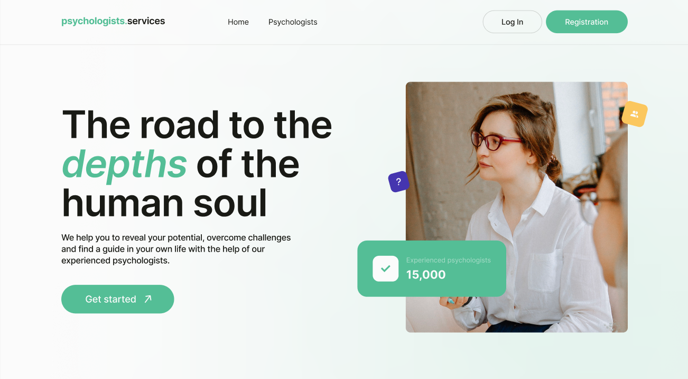
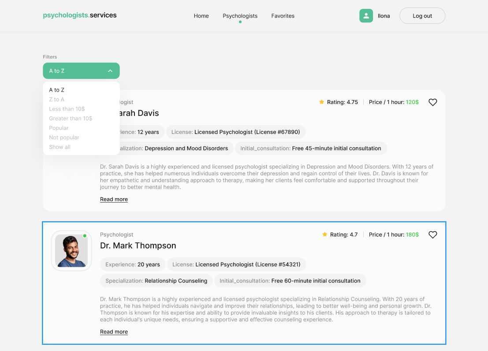

🧸 Psychologists.Services App
Цей застосунок допомагає знайти кваліфікованого психолога.
 Користувачі можуть переглядати список психологів, сортувати, фільтрувати, додавати у вибране, 
 переглядати детальну інформацію та залишати заявки на зустріч. 
 Доступ до повного функціоналу надається після авторизації.

🔗 Посилання на проект
Деплой на Vercel.app: 

Макет у Figma: https://www.figma.com/file/I5vjNb0NsJOpQRnRpMloSY/Psychologists.Services?type=design&node-id=0-1&mode=design&t=4zfT2zFANRbp1fCK-0

Репозиторій на GitHub: 

📌 Технічне завдання
Застосунок має три сторінки:

Home — головна сторінка з назвою сайту, слоганом, кнопкою-посиланням до сторінки психологів. Можливість зміни теми.

Psychologists — сторінка з переліком нянь, сортуванням та фільтрами.

Favorites — приватна сторінка з обраними психологами (доступна лише авторизованим користувачам).

🔐 Авторизація:
Реєстрація / Логін за допомогою Firebase Authentication

Робота з react-hook-form та yup для валідації форм

Поточний користувач зберігається в контексті

Закриття модальних вікон по кліку на Х, backdrop або Esc

💾 Дані:
Психологи зберігаються у Firebase Realtime Database

Структура колекції:

📄 Функціонал:
Сортування: за іменем, ціною, рейтингом
Фільтрація за ціною

Картки психологів з кнопками Read more, Make an appointment та серцем (обране)

Read more — відкриває деталі профілю

Make an appointment — форма заявки (з react-hook-form & yup)

Favorites — приватна сторінка для перегляду обраних психологів

Збереження обраного після оновлення сторінки

Обробка неавторизованого користувача (повідомлення)

🧑‍💻 Технології
React + Vite

React Router

Firebase (Auth, Realtime Database)

React Hook Form + Yup

Context API (для авторизації)

CSS Modules / Styled Components  (обрати залежно від реалізації)

Vercel / GitHub Pages — для деплою

🧰 Встановлення та запуск
Клонувати репозиторій:

git clone https://github.com/Nastya-20/Psychologists.Services.git
cd Psychologists.Services
Встановити залежності:

npm install
Додати Firebase-конфіг у .env файл:
VITE_FIREBASE_API_KEY=your_api_key
VITE_FIREBASE_AUTH_DOMAIN=your_auth_domain
VITE_FIREBASE_DATABASE_URL=your_database_url
VITE_FIREBASE_PROJECT_ID=your_project_id
Запустити локальний сервер:

npm run dev
✅ Критерії якості
📱 Адаптивність: від 320px до 1440px

🧠 Валідація: всі форми обов’язкові до заповнення

🔐 Безпека: приватна сторінка Favorites тільки для авторизованих

🔄 Збереження стану обраних

🚀 Деплой на Vercel.app

✅ Відсутність помилок у консолі

📚 Компонентний підхід без надлишкових коментарів

🧠 Автор
Anastasiia Tolmachova | GitHub: @Nastya-20

